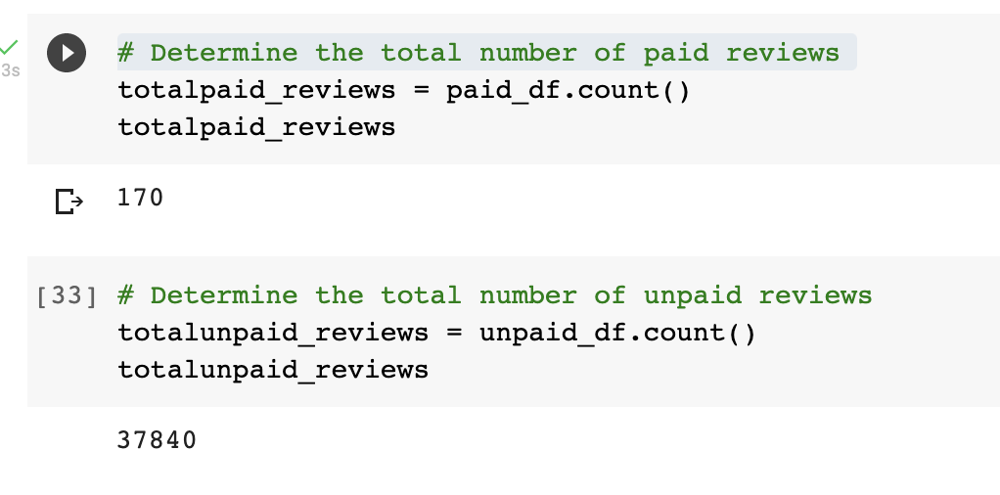
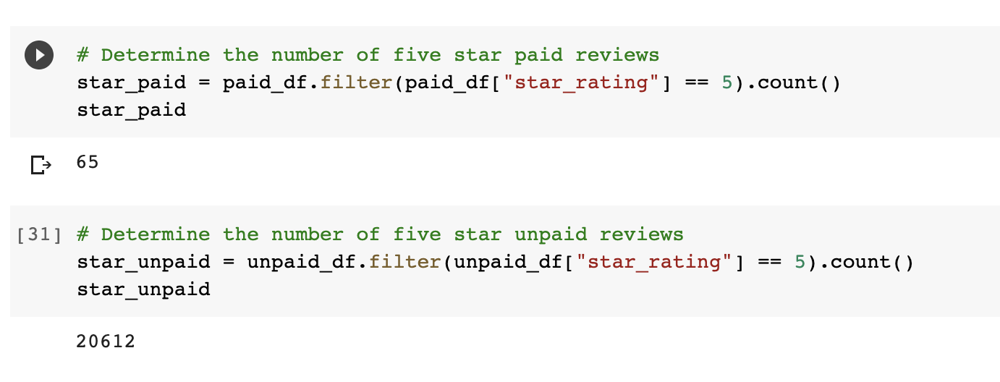
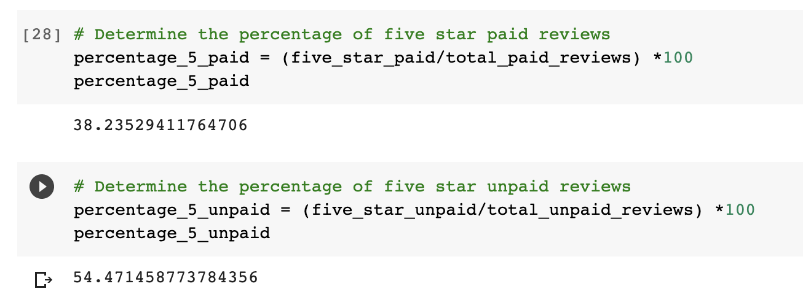

# Amazon Vine Analysis

## Overview
Manufacturers and publishers can get product reviews through the Amazon Vine program. Small fees are paid to Amazon by companies like SellBy, which then offer Amazon Vine users with items in exchange for a product review.

For this project we collected reviews data regarding pet products games and used "Pyspark" to conduct the ETL process of "extracting, transforming and connecting"  the data to a database that we created via the *AWS server*. Once this process was complete an analysis was carried out to determine if there was a favorable review bias from the Vine members in our data set.

## Results

#### How many Vine reviews and non-Vine reviews were there?

    - There were 170 Vine reviews and 37,840 *non-Vine reviews*. 

#### How many Vine reviews were 5 stars? How many non-Vine reviews were 5 stars? 

    - 65 of the Vine reviews were 5 star.
    - 20,612 of the non-Vine reviews were 5 star.

#### What percentage of Vine reviews were 5 stars? What percentage of non-Vine reviews were 5 stars?

    -  38.2% of the 5 star reviews were Vine.
    - 54.4% of the 5 star reviews were non-Vine.

## Summary

There are only 38.2% of "5 star" Vine reviews in the dataset as opposed to 54.4% of "5 star" non-Vine reviews which suggests a lack of bias. I believe there is a lack of proportion in the data set since 170 of the 37,840 reviews were from Vine users, which can lead to a lack representation in the analysis. 
